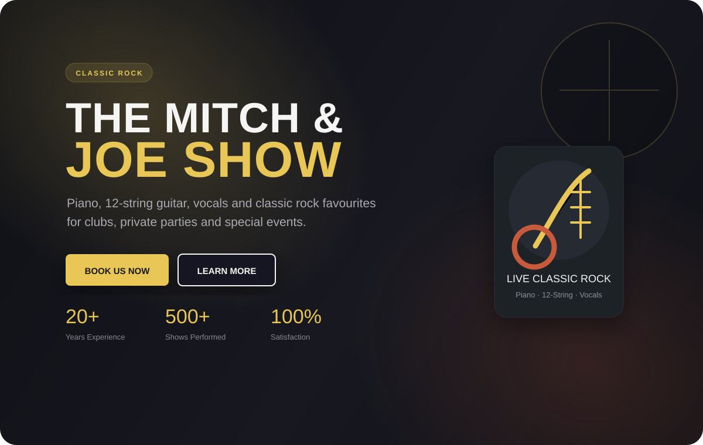
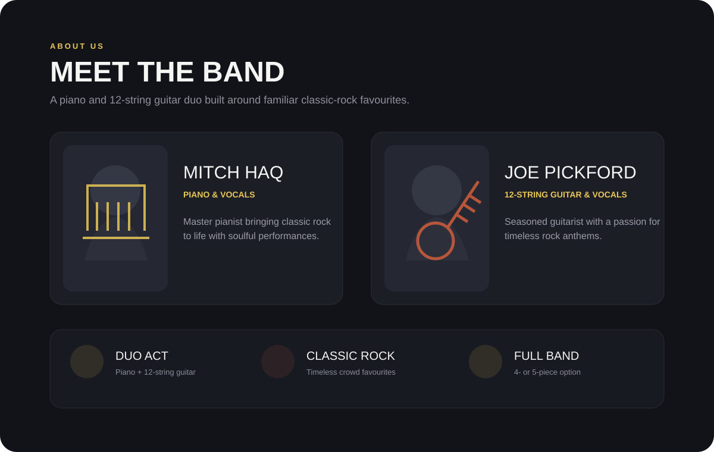
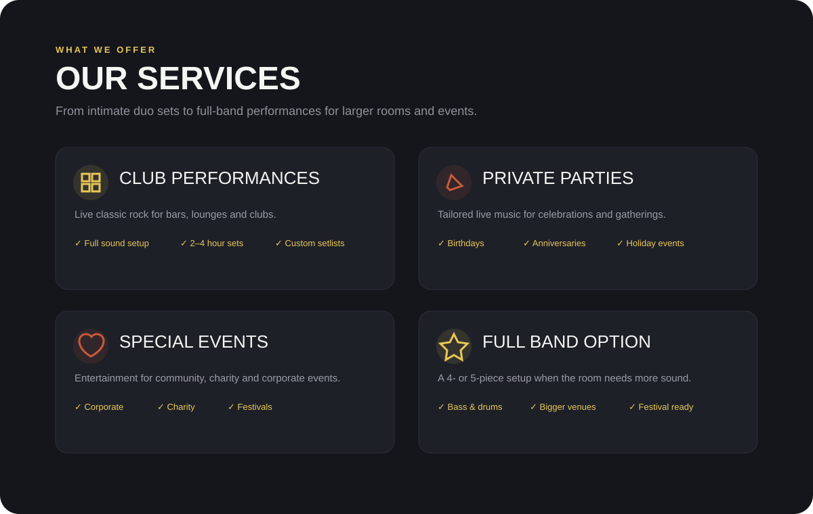
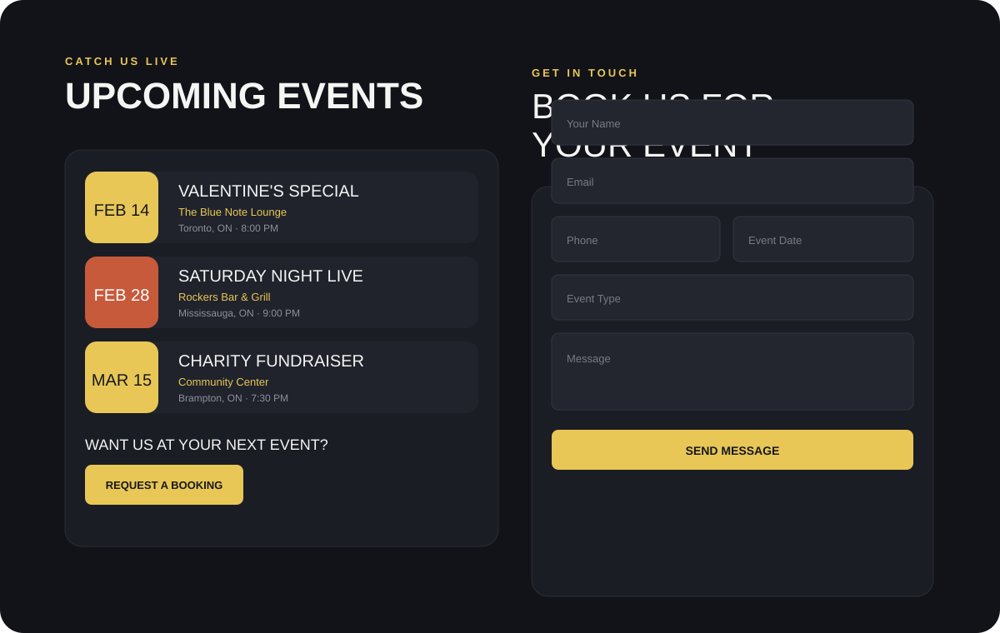

# The Mitch & Joe Show

**A responsive Angular website for a classic-rock duo, designed around live-show discovery, performance packages, upcoming events, and a direct booking journey.**

The Mitch & Joe Show is a single-page entertainment website built to turn a simple band presence into a clear booking experience. The interface combines a dark stage-inspired visual system with warm gold accents, prominent calls to action, performer profiles, service packages, upcoming-show listings, and a mobile-friendly enquiry form.

**[View the live demo](https://kyla-zeit.github.io/the-mitch-and-joe-show/)**

## Product preview

<p align="center">
  
  &nbsp;
  
</p>

<p align="center">
  <strong>Hero</strong>: immediate positioning, booking CTA, classic-rock branding, and performance statistics.<br/>
  <strong>Meet the Band</strong>: performer profiles, instruments, duo format, and full-band option.
</p>

<p align="center">
  
  &nbsp;
  
</p>

<p align="center">
  <strong>Performance packages</strong>: club shows, private parties, special events, and a larger band configuration.<br/>
  <strong>Events & booking</strong>: upcoming performances connected directly to an enquiry-focused contact form.
</p>

> The portfolio previews above are source-faithful visualizations based directly on the current Angular components, labels, content, and dark / gold / rust design system. The live GitHub Pages build is the authoritative interactive demo.

## Project at a glance

| Area | Implementation |
| --- | --- |
| Framework | Angular 17 |
| Language | TypeScript |
| Forms | Angular Forms / `ngModel` |
| Styling | Component-scoped CSS + shared global design tokens |
| Navigation | Smooth-scrolling single-page sections |
| Responsive UI | Mobile, tablet, and desktop layouts |
| Deployment | GitHub Pages via GitHub Actions |
| Primary experience | Entertainment marketing and booking website |

## The product flow

The site is deliberately structured as one continuous booking funnel rather than a collection of disconnected pages.

```text
Visitor
   ↓
Hero / Brand Positioning
   ↓
Meet Mitch & Joe
   ↓
Choose Performance Format
   ↓
See Upcoming Shows
   ↓
Request a Booking
   ↓
Contact Form
```

Every major section reinforces the same goal: explain the act quickly, show what can be booked, and make the next step obvious.

## Core experience

### Hero and booking CTA

The landing section introduces the act as **classic-rock entertainment** built around piano, 12-string guitar, and vocals.

It includes:

- Large performance-focused headline
- Short value proposition for clubs, parties, and special events
- Primary **Book Us Now** action
- Secondary **Learn More** action
- Performance statistics
- Dark photographic background with layered overlay and accent glows
- Animated scroll indicator

The visual direction uses a charcoal stage-like backdrop with gold and warm rust accents to establish the music identity immediately.

### Band presentation

The About section gives each performer a dedicated profile while keeping the duo format easy to understand.

Current presentation includes:

- **Mitch Haq** - piano and vocals
- **Joe Pickford** - 12-string guitar and vocals
- Performer descriptions
- Duo-act positioning
- Classic-rock repertoire emphasis
- Full-band availability for larger events

This section answers the basic booking question quickly: who is performing, what do they play, and what size of act is available?

### Performance packages

The Services component separates bookings into four clear use cases:

| Service | Positioning |
| --- | --- |
| Club Performances | Live classic rock for bars, lounges, and venue programming |
| Private Parties | Birthday, anniversary, and holiday entertainment |
| Special Events | Corporate, charity, community, and festival appearances |
| Full Band Option | Expanded 4- or 5-piece setup for larger venues |

Each service card combines a short description with practical booking details such as sound setup, set length, event types, or larger-band instrumentation.

### Upcoming events

The Events section provides a compact list of upcoming appearances with:

- Date
- Event title
- Venue
- City
- Performance time

Each listing stays deliberately simple so visitors can scan where the act is playing without leaving the one-page experience.

A **Request a Booking** CTA connects the events section directly to the enquiry form.

### Booking enquiry form

The contact experience collects the information needed for an initial entertainment enquiry:

- Name
- Email
- Phone
- Event date
- Event type
- Message

The date field uses the browser's native `date` input, allowing mobile devices to provide their own familiar date-selection UI rather than forcing a custom desktop-first picker onto a phone.

The submit button is tied to Angular form validity, so required fields must be completed before submission becomes available.

> **Current scope:** the form demonstrates client-side Angular form handling. Submitting currently shows a confirmation, logs the form data in the browser, and resets the fields. It is not connected to an email service or production booking backend.

## Component architecture

The application is divided into focused Angular components rather than placing the entire page in one template.

```text
AppComponent
   │
   ├── Header
   ├── Hero
   ├── About
   ├── Services
   ├── Events
   ├── Contact
   └── Footer
```

This keeps content, styles, and component logic separated while still supporting the intentionally seamless one-page experience.

## Design system

The shared global theme establishes the overall visual language with CSS custom properties.

### Visual direction

- Near-black / charcoal background
- Slightly lighter card surfaces
- Warm gold primary accent
- Rust-toned secondary accent
- High-contrast light text
- Muted grey supporting copy
- Bold display typography for section headings

### Interaction

- Smooth section scrolling
- Clear primary and secondary calls to action
- Hover lift on buttons and cards
- Responsive content grids
- Large touch-friendly controls
- Native browser form inputs where appropriate

## Responsive approach

The layout adapts from stacked mobile sections into wider desktop grids while keeping the booking journey intact.

Responsive behavior includes:

- Stacked hero buttons on smaller screens
- Flexible performer and service cards
- Responsive heading sizes
- Mobile-friendly form fields
- Wider container padding at tablet and desktop breakpoints
- Consistent section rhythm across viewport sizes

## Tech stack

```text
Angular 17
TypeScript 5
Angular Forms
RxJS
HTML5
Component-scoped CSS
GitHub Actions
GitHub Pages
```

## Run locally

Requirements:

- Node.js
- npm

Install dependencies:

```bash
npm install
```

Start the Angular development server:

```bash
npm start
```

Then open the local Angular URL shown in the terminal, typically:

```text
http://localhost:4200
```

## Build

Create a production build with:

```bash
npm run build
```

For the GitHub Pages deployment, the repository workflow supplies the project base path automatically:

```bash
npm run build -- --base-href /the-mitch-and-joe-show/
```

## GitHub Pages deployment

Deployment is automated through GitHub Actions whenever `main` is updated.

```text
Push to main
     ↓
npm ci
     ↓
Angular production build
     ↓
Upload Pages artifact
     ↓
GitHub Pages deployment
```

Live site:

**https://kyla-zeit.github.io/the-mitch-and-joe-show/**

## Project structure

```text
the-mitch-and-joe-show/
├── .github/
│   └── workflows/
│       └── deploy.yml
├── docs/
│   └── assets/                 # README portfolio previews
├── src/
│   ├── app/
│   │   ├── components/
│   │   │   ├── about/
│   │   │   ├── contact/
│   │   │   ├── events/
│   │   │   ├── footer/
│   │   │   ├── header/
│   │   │   ├── hero/
│   │   │   └── services/
│   │   ├── app.component.*
│   │   └── app.module.ts
│   ├── index.html
│   ├── main.ts
│   └── styles.css
├── angular.json
├── package.json
└── README.md
```

## Scope

The Mitch & Joe Show is a portfolio-scale front-end entertainment website. Its focus is presentation, responsive layout, booking UX, component architecture, and GitHub Pages deployment. It does not currently include a booking database, payment processing, calendar synchronization, or server-side form delivery.

Potential production extensions include email delivery for booking enquiries, spam protection, analytics, a CMS-backed event calendar, editable set lists, embedded audio/video, and availability management.